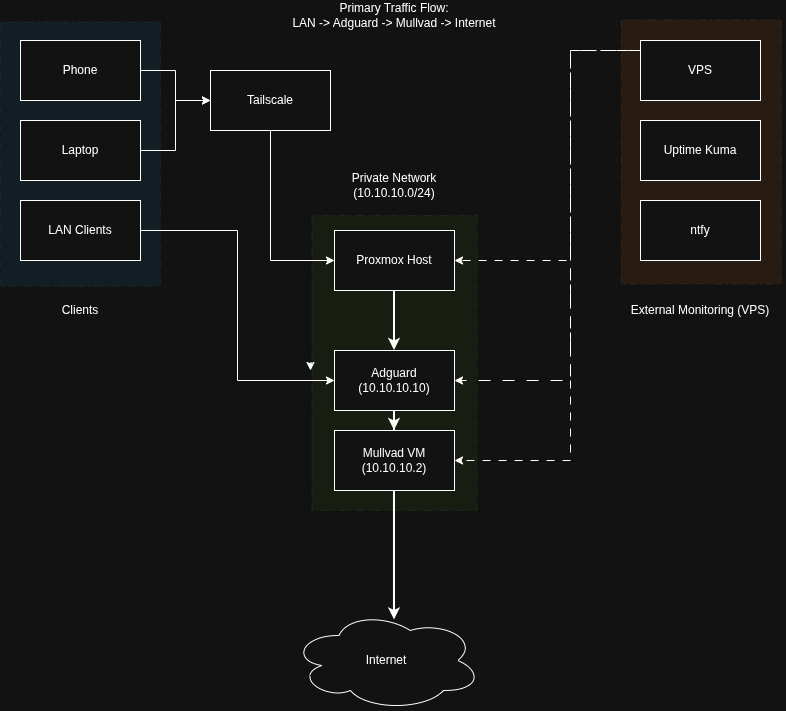

# Network Topology

## Diagram

## Overview
This homelab is designed to enforce controlled outbound traffic, centralised DNS filtering and ensure privacy through VPN routing, while maintaining secure remote access and external monitoring visibility.

## Design Goals
- Eliminate ISP visibility of DNS and outbound traffic
- Centralise DNS filtering and logging
- Route all outbound traffic through Mullvad VPN
- Provide secure remote access without exposing services publicly
- Maintain external monitoring for full outage detection
- Bypass limitations of ISP-provided routers

## Primary Traffic Flows
- LAN -> Adguard -> Mullvad -> Internet

## Access Model
- Remote access -> Tailscale -> Proxmox -> Adguard -> Mullvad -> Internet

## Monitoring
- External monitoring is handled via a VPS running Uptime Kuma and ntfy, ensuring alerting remains functional even if the homelab is offline.

## Failure Considerations
- Loss of Mullvad: outbound traffic fails or leaks depending on the firewall state.
- Loss of Adguard: DNS resolution fails for LAN clients.
- Loss of Tailscale: remote access is unavailable, but internal services remain unaffected.
- Homelab offline: detected via VPS monitoring and alerted through ntfy.
